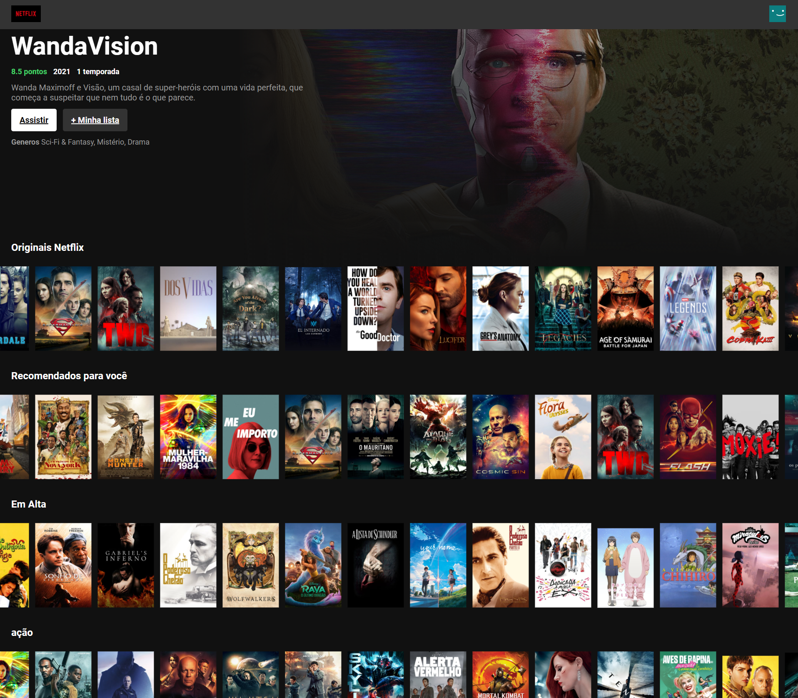

# Clone Netflix

## Sobre
Tutorial do Canal <b>Bonieky Lacerda</b>, clonando a tela do Netflix
<br>
Link do video:https://www.youtube.com/watch?v=tBweoUiMsDg&t=6990s

Veja o projeto online acessando o seguinte link https://netflix-clone-bruno.netlify.app/
<br/>
<br/>



---
## Tecnologia
- Consulta de ReactJS
- React-icons
- Consultando API Themoviedb  


## Pegar api
- Documentação para pegar API no site: https://www.themoviedb.org/
---
## Como instalar
Para baixar o projeto utilize o comando:

```term
git clone git@github.com:moraes3000/clone-netflix.git
```
Instale as dependências utilizando o comando:
```term
yarn install
```
Rode o projeto:
```term
yarn start
```

